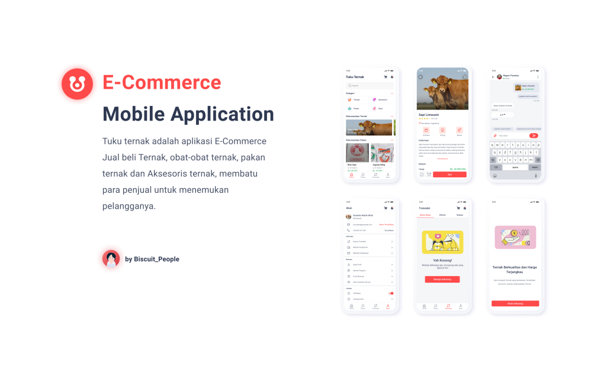

# Aplication TUKU TERNAK ([DEMO](https://github.com/Nanangprasetya/Tuku-Ternak.git))

Tuku Ternak is E-Commerce Sale and Purchase of Livestock, Livestock Medicine, Animal Feed and Equipment (accessories) Livestock, application helps sellers find customers.




## Figma Design

I used [Figma Tool](https://www.figma.com/file/pED21VlBNzvdpSvTSkQQQw/PROJECT-TukuTernak?node-id=0%3A1) to create a UI and UX design for this Tuku Ternak application.

* [Design Tuku Ternak](https://www.figma.com/file/pED21VlBNzvdpSvTSkQQQw/PROJECT-TukuTernak?node-id=0%3A1)

## Getting Started

For help getting started with Flutter, view our online
[documentation](https://flutter.io/).

**Step 1:**

Clone or download this repo by using the code below:

```
git clone https://github.com/Nanangprasetya/Tuku-Ternak.git
```

**Step 2:**

Go to project root and execute the following command in console to get the required dependencies:

```
flutter pub get
```

## Features :

* Splash Screen
* Swipper Screen
* Login Home Screen
* Sign In Screen
* Sign Up Screen
* Home Screen
* Detail Livestock Screen
* Responsive Screen (HOT)
* Localization with I10n (HOT)
* Firebase Storage (HOT)
* Management Routing (HOT)
* Bloc (State Management) (HOT)
* Connectivity with Bloc (HOT)
* Validation with Bloc (HOT)
* Api Http + Dio Request with Bloc (HOT)
* Theme Data with Bloc (HOT)

### Up-Coming Features :

* List Livestock Screen
* Localization with local Json
* Json Serialization
* Logging (Debuging)

### Folder Structure
Here is the core folder structure which Flutter Project.

```
lib/
|- Bloc/
    |- Api
    |- Localization
    |- Theme
    |- Validator
|- Service/
    |- Apis
    |- Localization
    |- Network
    |- Router
    |- Theme
    |- Validation
|- View/
    |- Debug
    |- Login
    |- Splash
    |- Swipper
|- Model
|- Data
|- I10n/
|- Util/
|- Widget/
```

### Plugins

* [Bloc](https://pub.dev/packages/flutter_bloc)
* [Dio](https://pub.dev/packages/dio)
* [Http](https://pub.dev/packages/http)
* [Firebase Storage](https://pub.dev/packages/firebase_storage)
* [Auto Size Text](https://pub.dev/packages/auto_size_text)
* [Image Picker](https://pub.dev/packages/image_picker)
* [Shared_Preference](https://pub.dev/packages/shared_preference)
* [Connectivity](https://pub.dev/packages/connectivity)
* [Provider](https://pub.dev/packages/provider)
* [Get It](https://pub.dev/packages/get_it)

### Social Media

* [Telegram Flutter Indonesian](https://t.me/flutter_id)
* [Instagram Biscuit People](https://www.instagram.com/biscuit_people/)
* [Dribbble Biscuit People](https://dribbble.com/biscuit_people)


### License

```
Copyright 2020 Biscuit People

Licensed under the Apache License, Version 2.0 (the "License");
you may not use this file except in compliance with the License.
You may obtain a copy of the License at

   http://www.apache.org/licenses/LICENSE-2.0

Unless required by applicable law or agreed to in writing, software
distributed under the License is distributed on an "AS IS" BASIS,
WITHOUT WARRANTIES OR CONDITIONS OF ANY KIND, either express or implied.
See the License for the specific language governing permissions and
limitations under the License.
```
